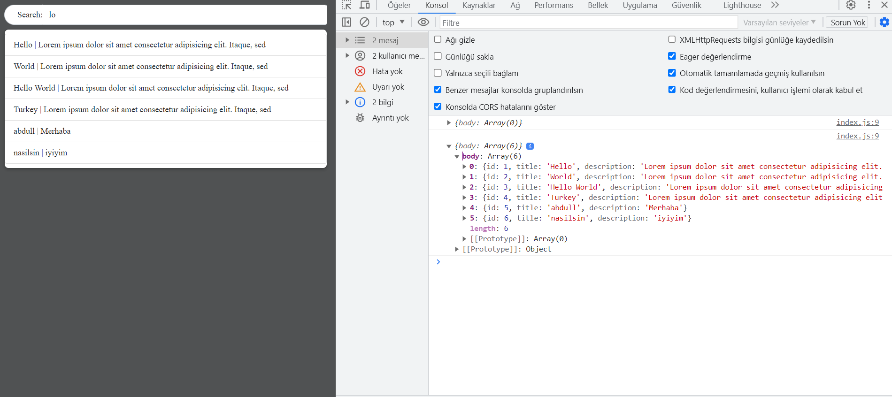
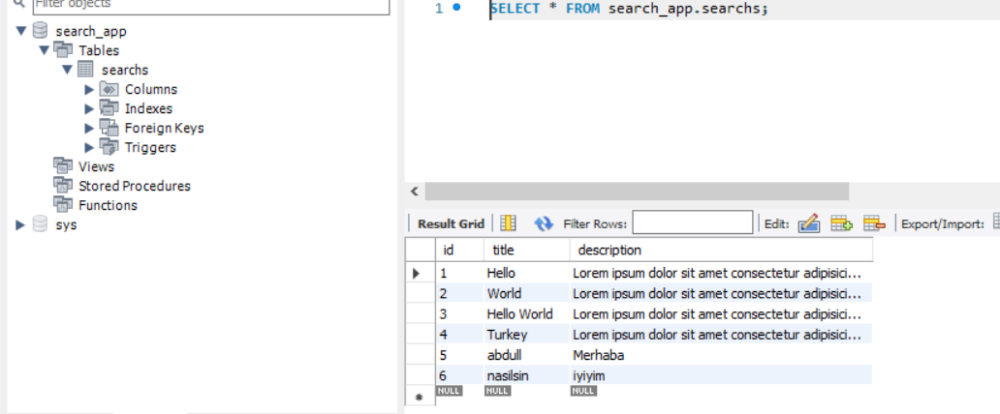

<p align="center">
  <a href="" rel="noopener">
 </a>
 </a>
</a>
</p>

<h3 align="center">live Search Console with socket.io and php </h3>

<div align="center">

[](/LICENSE)

</div>

---


## 🏁 Başlangıç <a name = "getting_started"></a>
### Kurulum için gerekenler
- <a href="https://www.docker.com/products/docker-desktop/">Docker</a>

### Kurulum

```
git clone https://github.com/abdullahciftci034/socket.io-search-console-nodejs-php-mysql.git
```
```
cd socket.io-search-console-nodejs-php-mysql
```
```
docker-compose build
```
```
docker-compose up
```
Browserdan açın:
<a href="http://localhost">http://localhost</a>
### 📝 İçerik

- [Socket.io](#socket-io)
- [Nodejs](#nodejs)
- [Php](#php)
- [Mysql](#mysql)
- [search console](#search-console)
- [docker](#docker)

### Preview

